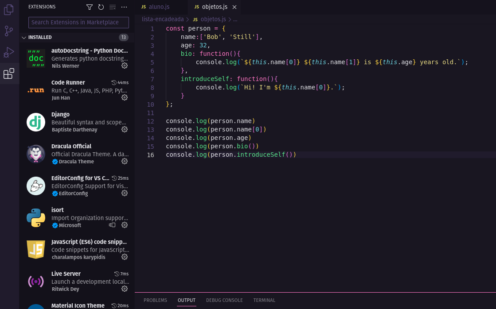

Minha decisão em utilizar o VisualStudio como principal ferramenta de desenvolvimento,
 varia do princípio de facilidade e performance.
Além de ter um visual muito agradável à ferramenta conta com um ambiente amigável e rico
em ferramentas que auxiliam o processo de desenvolvimento.
Outro ponto que destaco e a versatilidade de rodar em vários sistemas.
Para mim que sou usuário Linux isso e de muita ajuda.
Abaixo uma imagem sobre meu ambiente atual.

