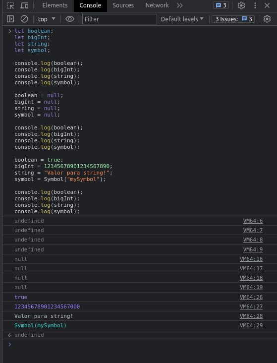

let boolean;
let bigInt;
let string;
let symbol;

console.log(boolean);
console.log(bigInt);
console.log(string);
console.log(symbol);

boolean = null;
bigInt = null;
string = null;
symbol = null;

console.log(boolean);
console.log(bigInt);
console.log(string);
console.log(symbol);

boolean = true;
bigInt = 12345678901234567890;
string = "Valor para string!";
symbol = Symbol("mySymbol");

console.log(boolean);
console.log(bigInt);
console.log(string);
console.log(symbol);

