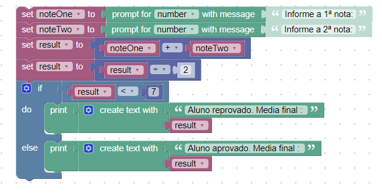

## **INSTRUÇÕES DO PROJETO**

*No hipertexto anterior, temos um exemplo de um fluxograma que realiza o cálculo da média de duas notas de um aluno. O fluxograma solicita duas notas que serão somadas, e logo em seguida a média dessas notas é calculada. Dessa forma o resultado da média quando é maior ou igual a 7 o aluno está APROVADO, quando menor que 7 o aluno está REPROVADO.*

*Utilizando o Google Blockly construa o algoritmos que realiza esse processamento.:*

 

.

### Resolução:

	var noteOne, noteTwo, result;

    noteOne = Number(window.prompt('Informe a 1ª nota:'));
    noteTwo = Number(window.prompt('Informe a 2ª nota:'));
    result = noteOne + noteTwo;
    result = result / 2;
    if (result < 7) {
      window.alert('Aluno reprovado. Media final : ' + String(result));
    } else {
      window.alert('Aluno aprovado. Media final : ' + String(result));
    }

