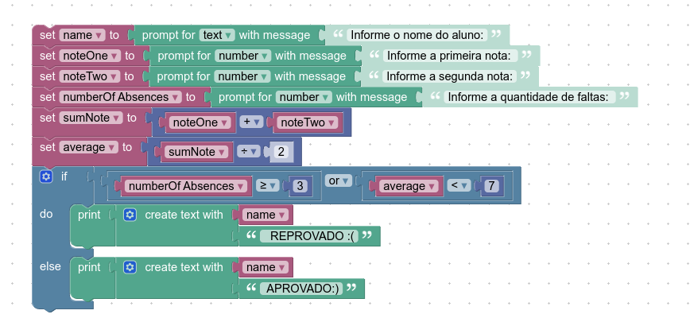

# INSTRUÇÕES DO PROJETO

*Desenvolva, utilizando o Google Blockly, um programa que utiliza o nome de um aluno, duas notas e a quantidade de faltas que ele teve. Conclua se o aluno está aprovado ou reprovado de acordo com as especificações:*
 
- Se a média do aluno for menor que sete, o sistema deve informar o nome do aluno e que ele está reprovado;
- Se o aluno possuir mais de três faltas, o sistema deve informar o nome do aluno e que ele está reprovado;
Se a média do aluno for maior ou igual a sete, o sistema deve informar o nome do aluno e que ele está aprovado.

*No sistema, todos os valores devem estar armazenados em variáveis.*

## Resolução:

    var name2, noteOne, noteTwo, numberOf_Absences, sumNote, average;

    name2 = window.prompt('Informe o nome do aluno:');
    noteOne = Number(window.prompt('Informe a primeira nota: '));
    noteTwo = Number(window.prompt('Informe a segunda nota:'));
    numberOf_Absences = Number(window.prompt('Informe a quantidade de faltas: '));
    
    sumNote = noteOne + noteTwo;
    average = sumNote / 2;
    if (numberOf_Absences >= 3 || average < 7) {
      window.alert(String(name2) + '  REPROVADO :(');
    } else {
      window.alert(String(name2) + ' APROVADO:)');
    }

