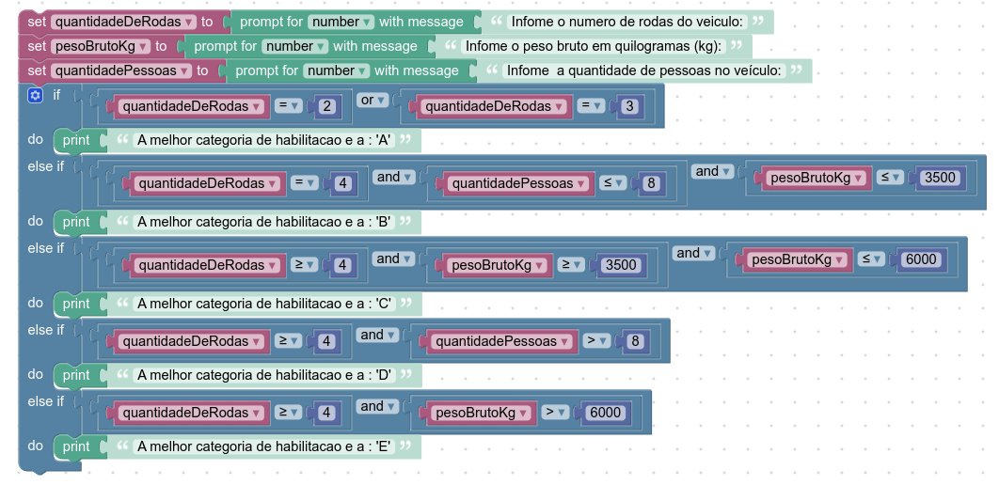

# INSTRUÇÕES DO PROJETO

*Desenvolva um código, utilizando o Google Blockly, que utilize as seguintes características de um veículo:*
-  **Quantidade de rodas;**
-  **Peso bruto em quilogramas;**
-  **Quantidade de pessoas no veículo.**

*Com essas informações, o programa mostrará qual é a melhor categoria de habilitação para o veículo informado a partir das condições:*
- A: Veículos com duas ou três rodas;
- B: Veículos com quatro rodas, que acomodam até oito pessoas e seu peso é de até 3500 kg;
- C: Veículos com quatro rodas ou mais e com peso entre 3500 e 6000 kg;
- D: Veículos com quatro rodas ou mais e que acomodam mais de oito pessoas;
- E: Veículos com quatro rodas ou mais e com mais de 6000 kg.

## Resolução:

  
  
  
  **codigo**

  var quantidadeDeRodas, pesoBrutoKg, quantidadePessoas;

  quantidadeDeRodas = Number(window.prompt('Infome o numero de rodas do veiculo:'));
  pesoBrutoKg = Number(window.prompt('Infome o peso bruto em quilogramas (kg):'));
  quantidadePessoas = Number(window.prompt('Infome  a quantidade de pessoas no veículo:'));
  if (quantidadeDeRodas == 2 || quantidadeDeRodas == 3) {
    window.alert('A melhor categoria de habilitacao e a : \'A\'');
  } else if (quantidadeDeRodas == 4 && quantidadePessoas <= 8 && pesoBrutoKg <= 3500) {
    window.alert('A melhor categoria de habilitacao e a : \'B\'');
  } else if (quantidadeDeRodas >= 4 && pesoBrutoKg >= 3500 &&   pesoBrutoKg <= 6000) {
   window.alert('A melhor categoria de habilitacao e a : \'C\'');
  } else if (quantidadeDeRodas >= 4 && quantidadePessoas > 8) {
  window.alert('A melhor categoria de habilitacao e a : \'D\'');
  } else if (quantidadeDeRodas >= 4 && pesoBrutoKg > 6000) {
  window.alert('A melhor categoria de habilitacao e a : \'E\'');
  }

