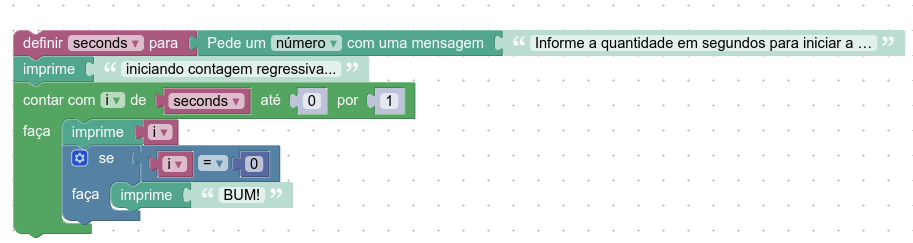

# INSTRUÇÕES DO PROJETO

*Faça um código, utilizando o Google Blockly, que execute a contagem regressiva de uma bomba, informando o número de segundos para explodir. Ele deverá mostrar a mensagem “iniciando contagem regressiva”, os segundos passados e, no final, a mensagem “BUM!”.*

## Resolução:

  
  
  
  **codigo fonte:**

    var seconds, i;

    seconds = Number(window.prompt('Informe a quantidade em segundos para iniciar a contagem:'));
    window.alert('iniciando contagem regressiva...');
    var i_inc = 1;
    if (seconds > 0) {
      i_inc = -i_inc;
    }
    for (i = seconds; i_inc >= 0 ? i <= 0 : i >= 0; i += i_inc) {
      window.alert(i);
      if (i == 0) {
        window.alert('BUM!');
      }
    }

