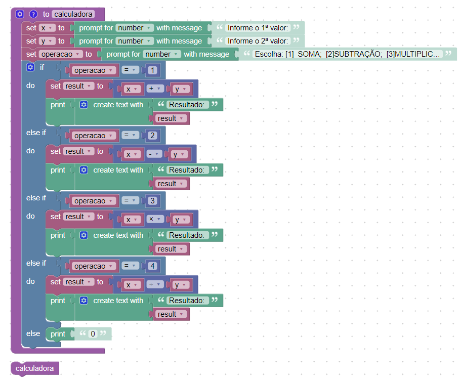

# INSTRUÇÕES DO PROJETO

*Faça uma função calculadora de dois números com três parâmetros: os dois primeiros serão os números da operação e o terceiro será a entrada que definirá a operação a ser executada. Considera a seguinte definição:*
- 1. Soma
-  2. Subtração
- 3. Multiplicação
- 4. Divisão

## Resolução:

  

  **codigo fonte:**

    var x, y, operacao, result;
    
    // Describe this function...
    function calculadora() {
      x = Number(window.prompt('Informe o 1ª valor:'));
      y = Number(window.prompt('Informe o 2ª valor:'));
      operacao = Number(window.prompt('Escolha: [1]  SOMA;  	[2]SUBTRAÇÃO;  [3]MULTIPLICAÇÃO;  [4]DIVISÃO'));
      if (operacao == 1) {
        result = x + y;
        window.alert('Resultado: ' + String(result));
      } else if (operacao == 2) {
        result = x - y;
        window.alert('Resultado: ' + String(result));
      } else if (operacao == 3) {
        result = x * y;
        window.alert('Resultado: ' + String(result));
      } else if (operacao == 4) {
        result = x / y;
        window.alert('Resultado: ' + String(result));
      } else {
        window.alert('0');
      }
    }

    calculadora();