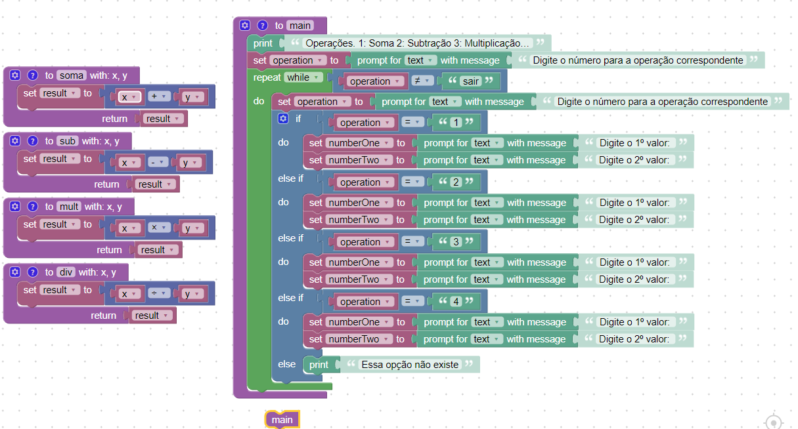

# INSTRUÇÕES DO PROJETO :

*Faça, utilizando o Google Blockly, uma função calculadora que os números e as operações serão feitas pelo usuário. O código deve ficar rodando infinitamente até que o usuário escolha a opção de sair. No início, o programa mostrará a seguinte lista de operações:*
- 1: Soma
- 2: Subtração
- 3: Multiplicação
- 4: Divisão
- 0: Sair

*Digite o número para a operação correspondente e caso o usuário introduza qualquer outro, o sistema deve mostrar a mensagem “Essa opção não existe” e voltar ao menu de opções.*

*Após a seleção, o sistema deve pedir para o usuário inserir o primeiro e segundo valor, um de cada. Depois precisa executar a operação e mostrar o resultado na tela. Quando o usuário escolher a opção “Sair”, o sistema irá parar.*

*É necessário que o sistema mostre as opções sempre que finalizar uma operação e mostrar o resultado.*

## Codigo:

    var x, y, result, operation, numberOne, numberTwo;

    // Describe this function...
    function main() {
      window.alert('Operações. 1: Soma 2: Subtração 3: Multiplicação 4: Divisão 0: Sair');
      operation = window.prompt('Digite o número para a operação correspondente');
      while (operation != 'sair') {
        operation = window.prompt('Digite o número para a operação correspondente');
        if (operation == '1') {
          numberOne = window.prompt('Digite o 1º valor: ');
          numberTwo = window.prompt('Digite o 2º valor: ');
        } else if (operation == '2') {
          numberOne = window.prompt('Digite o 1º valor: ');
          numberTwo = window.prompt('Digite o 2º valor: ');
        } else if (operation == '3') {
          numberOne = window.prompt('Digite o 1º valor: ');
          numberTwo = window.prompt('Digite o 2º valor: ');
        } else if (operation == '4') {
          numberOne = window.prompt('Digite o 1º valor: ');
          numberTwo = window.prompt('Digite o 2º valor: ');
        } else {
          window.alert('Essa opção não existe');
        }
      }
    }

    // Describe this function...
    function soma(x, y) {
      result = x + y;
      return result;
    }

    // Describe this function...
    function sub(x, y) {
      result = x - y;
      return result;
    }

    // Describe this function...
    function mult(x, y) {
      result = x * y;
      return result;
    }

    // Describe this function...
    function div(x, y) {
      result = x / y;
      return result;
    }

    main();
