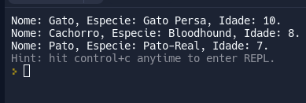

# DESAFIO:

*Nesta atividade, você deve criar um código em JavaScript com uma matriz bidimensional para armazenar informações sobre animais e as suas características.*

*Cada linha deve representar um animal e cada coluna terá as diferentes informações sobre ele, como nome, espécie e idade.*

## Codigo:

    const pets = [
    
    ['Garfield', 'Gato', 10],
    ['Pateta', 'Cachorro', 8],
    ['Donald', 'Pato', 7]

    ]

    for (let i=0; i<pets.length;i++){
      console.log(`Nome: ${pets[i][0]}, Especie: ${pets[i][1]}, Idade: ${pets[i][2]}.`)
    }

## Saida:

